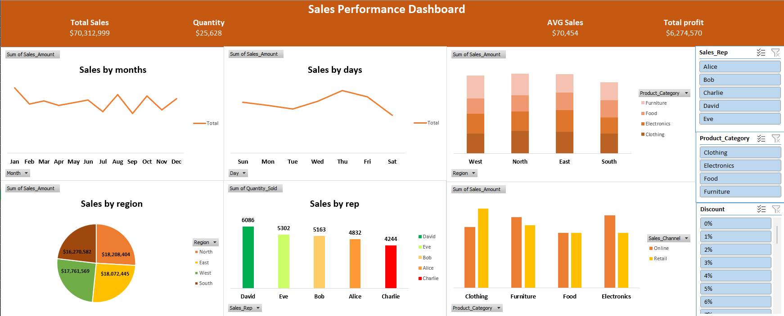

# Data-Cleaning-and-Sales-Analysis
# 📊 Sales Data Analysis using Excel

## 📌 Project Overview
This project demonstrates **end-to-end data analysis using Excel**, starting from raw data cleaning to creating a **sales performance dashboard**.  
It highlights essential Excel skills such as data cleaning, pivot tables, and dashboard design.

---

## 📂 Files in this Repository
- **Raw_Data.xlsx** → Original dataset before cleaning.  
- **Cleaned_Data_Dashboard.xlsx** → Cleaned dataset with pivot tables and dashboard.  
- **README.md** → Project documentation.  

---

## 🛠️ Steps Performed
1. **Data Cleaning**  
   - Removed duplicates.  
   - Trimmed extra spaces.  
   - Handled missing values.  
   - Corrected data types (e.g., dates, numbers).   

2. **Data Analysis**  
   - Created **Pivot Tables** to summarize sales by region, category, sales rep, and month.  
   - Calculated KPIs such as total sales, average sales, and profit.  

3. **Dashboard Creation**  
   - Built an **interactive sales dashboard** in Excel.  
   - Included charts for monthly sales, top regions, and product categories.  
   - Added KPIs (Total Sales, Average Sales, Quantity Sold, Total Profit).  

---

## 📈 Key Insights
- **January** recorded the highest total sales among all months.  
- **Thursday** was the most active sales day.  
- The **North region** achieved the highest total sales.  
- **David** sold the largest number of items (highest quantity sold).  
- **Clothing** was the top-selling category in the **North** region.  
- In the **East** region, **Electronics** and **Food** were the best-performing categories.  
- In the **West** region, **Furniture** had the highest sales.  
- **Electronics** was the most sold category through **Online** channels.  
- **Clothing** was the most sold category through **Retail** channels.  

---

## 📸 Dashboard Preview

---

## 🚀 Tools & Skills Demonstrated
- **Microsoft Excel**  
  - Data Cleaning  
  - Pivot Tables  
  - Charts & Visualization  
  - Dashboard Design  

---

